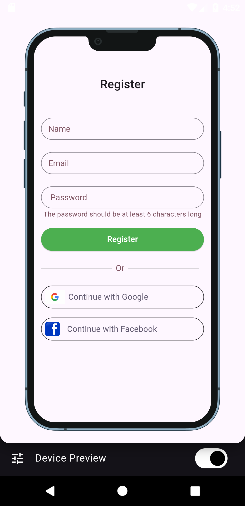
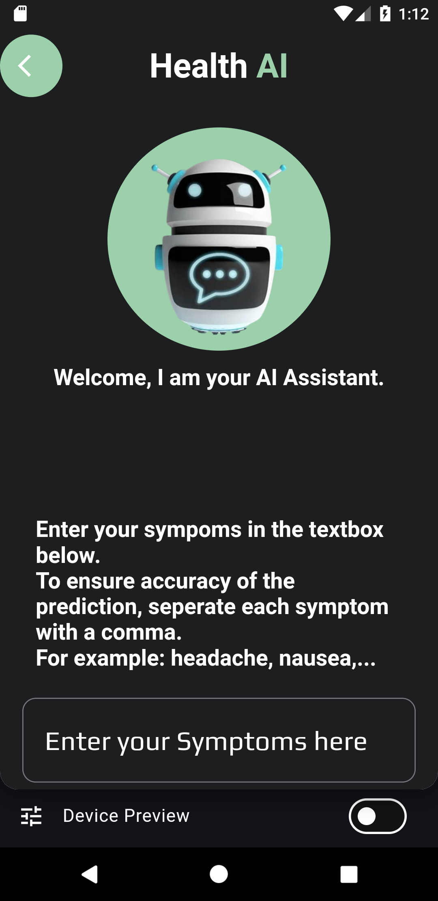
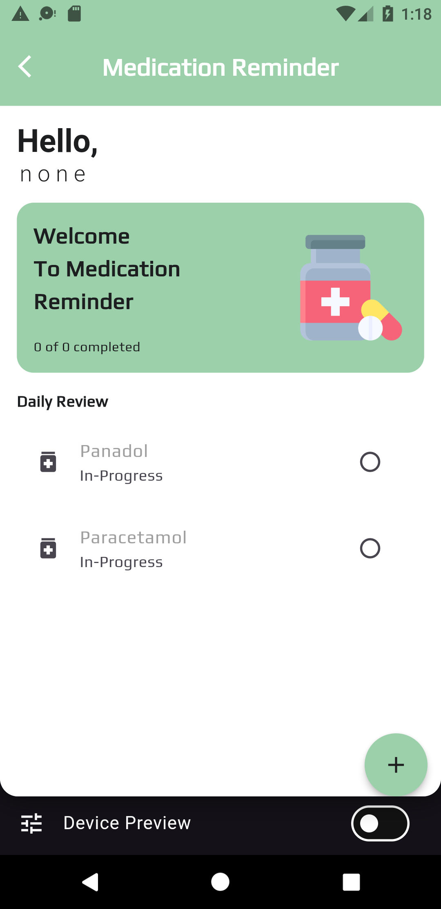
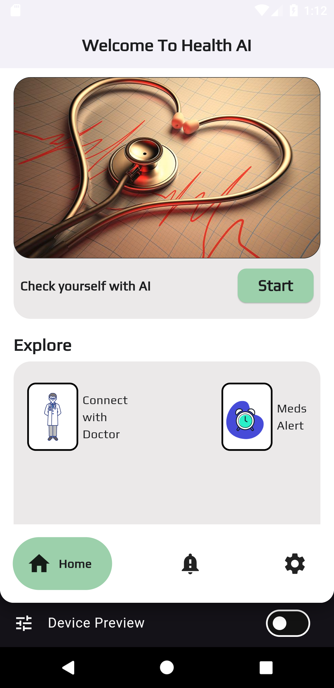
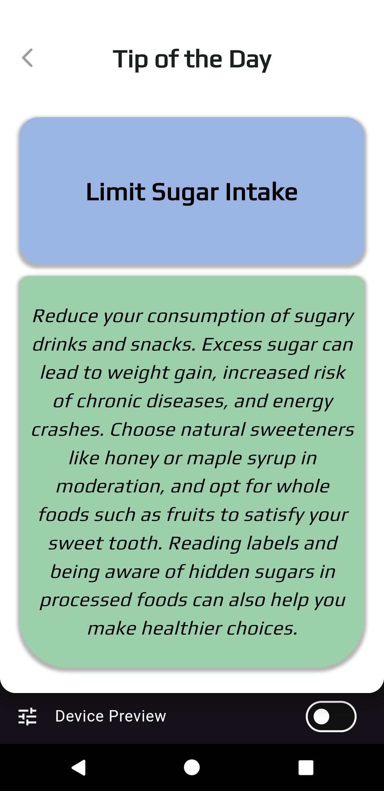

# 🧠 AI Mobile Health App

An intelligent mobile healthcare assistant built with Flutter and AI to help users get fast symptom analysis, medical insights, and professional support — all from one mobile app.

---

## ✨ Features

- 🤖 **AI Symptom Checker**  
  Input your symptoms and receive an instant, AI-generated preliminary diagnosis powered by a Convolutional Neural Network (CNN) model.

- 🧬 **Generative AI Disease Explanation**  
  The app uses generative AI to explain your potential diagnosis in a simple, user-friendly way.

- 💬 **In-App Medical Chat**  
  Chat in real-time with certified medical professionals for expert medical advice.

- 📅 **Daily Health Tips**  
  Receive daily health advice and preventive care suggestions tailored to your needs.

- 💊 **Medication Reminders**  
  Never miss a dose again. Set and manage custom medication reminders right from the app.

---

## 🛠️ Tech Stack

### 📱 Frontend
- **[Flutter](https://flutter.dev/)** — Cross-platform UI framework
- **[Provider](https://pub.dev/packages/provider)** — State management

### 🌐 Backend
- **Node.js** — RESTful API server
- **MySQL** — Relational database for data storage

### 🧠 AI/ML
- **Model**: Convolutional Neural Network (CNN)
- **Dataset**: Curated medical dataset for disease prediction
- **Integration**: Model connected to the backend for real-time inference

## 📸 Screenshots

### 🔍 Registration

### 💬 AI Diagnosis

### ⏰ Medication Reminder

### Homepage

### ⏰ Medication Reminder

### ⏰ Medication Reminder

